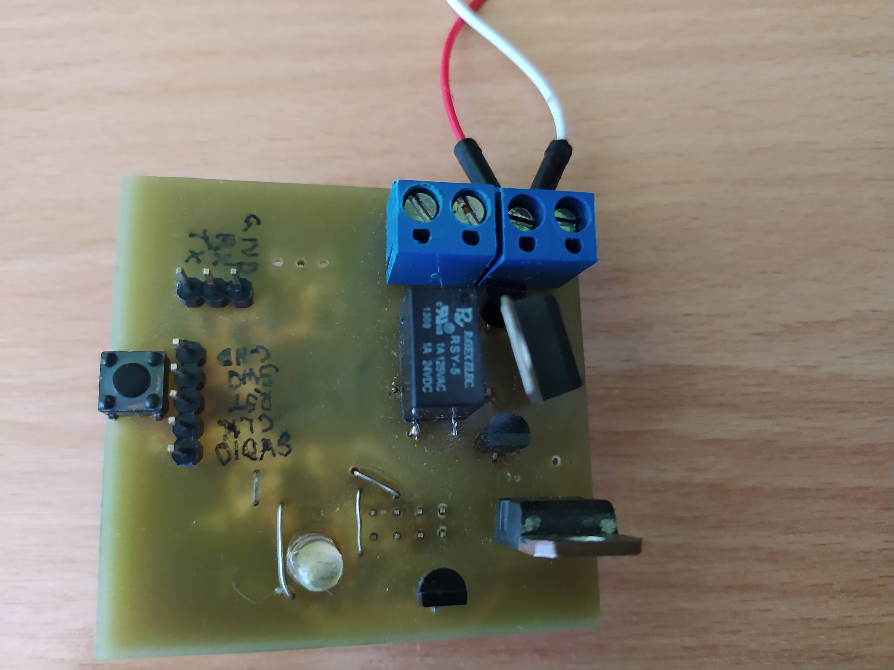
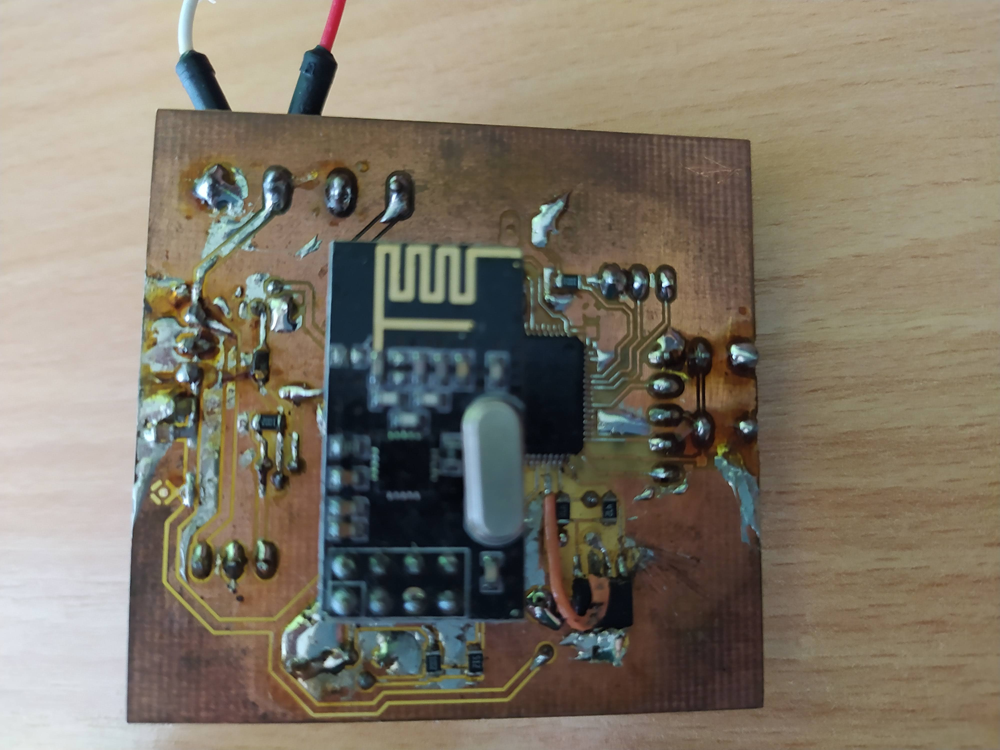
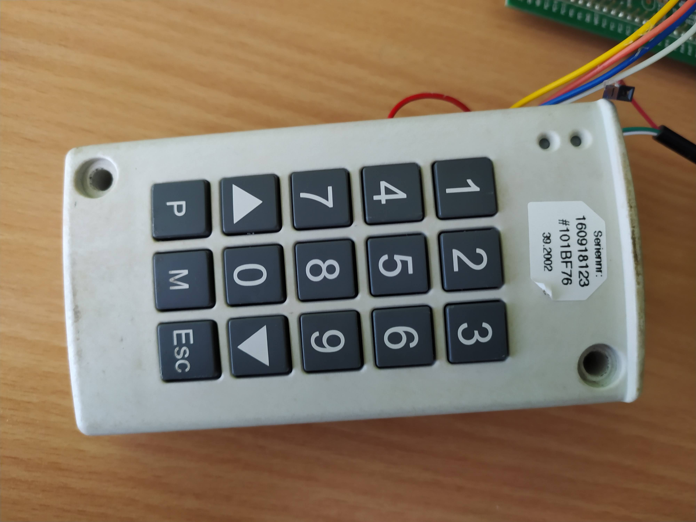
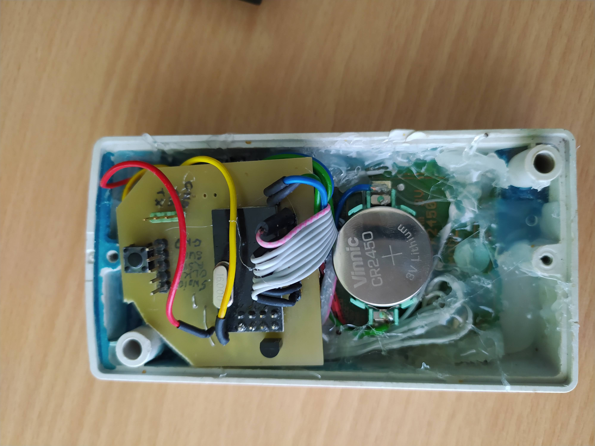
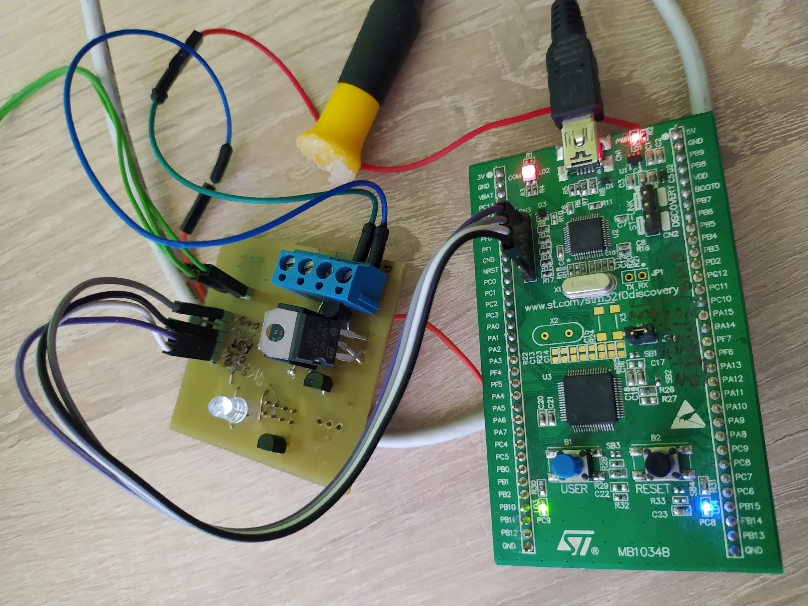
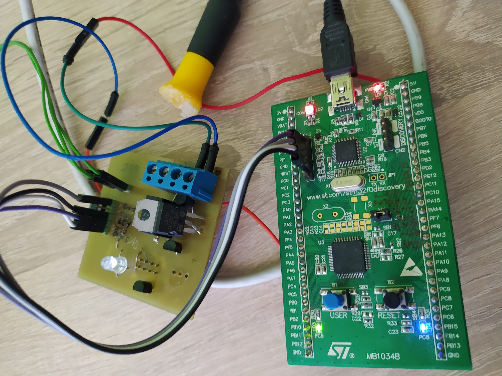
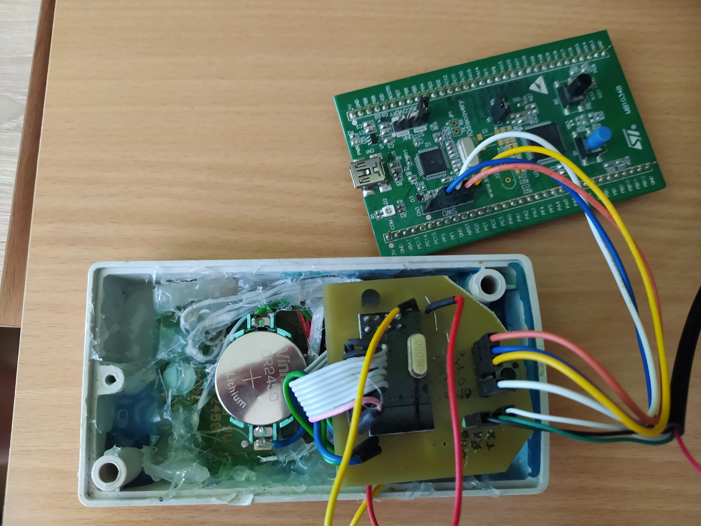

# GarageDoorKeypad

Keypad and Node applications based on STM32F051R8TX uC. Communication between them is done with ISM NRF24L01+ radio modules.

## HARDWARE
* Microcontroller: STM32F051R8TX
* Radio: NRF24L01+
HW schematics for both Keypad and Node available [here](docs/schematics).

## BUILD INSTRUCTIONS
* `STM32CubeIDE ver.1.3.0` with `STM32Cube FW_L0 V1.11.2` is used for development: https://www.st.com/en/development-tools/stm32cubeide.html
* STM32Cube FW_L0 V1.11.2
* Before a first build, please change all the paths `/home/luk6xff/Projects/GarageDoorKeypad/keypad/` and `/home/luk6xff/Projects/GarageDoorKeypad/node/` in files: `.cproject` , `.mxproject` , `.project` for both projects.
* Press `Build Release` button (hammer icon) in IDE to compile a project.
* Press `Run` button (play icon) in IDE to flash a uC.

## Some pics

* Node:



* Keypad:



* Connections:





## FAQ
1. To flash SW from CLI:
```sh
~/Tools/STM32/STM32CubeProgrammer/bin/STM32_Programmer_CLI -c port=SWD reset=Hwrst -d ~/Projects/GarageDoorKeypad/.pio/build/disco_f051r8/firmware.elf
```

2. Erase all memory:
```sh
 ~/Tools/STM32/STM32CubeProgrammer/bin/STM32_Programmer_CLI -c port=SWD -e all
```

3. Datasheets to be found [here](docs/datasheets).